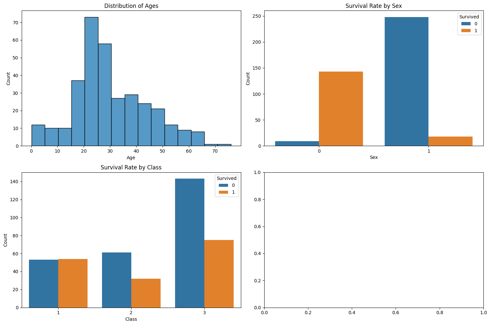

**Titanic Survival Prediction Model**
=====================================

**Overview**
------------

This project uses a logistic regression model to predict the survival of passengers on the Titanic based on their characteristics. The model achieves an accuracy score of 0.94, indicating that it correctly predicts the survival of 94% of the passengers.

**Dataset**
------------

The dataset used for this project is the Titanic dataset from Kaggle. The dataset contains information about 891 passengers, including their age, sex, class, fare, and whether they survived the disaster.

**Features**
------------

The following features are used in the model:

* **Age**: The age of the passenger
* **Sex**: The sex of the passenger (male or female)
* **Pclass**: The class of the passenger (1st, 2nd, or 3rd)
* **Fare**: The fare paid by the passenger
* **SibSp**: The number of siblings/spouses aboard
* **Parch**: The number of parents/children aboard
* **Embarked**: The port of embarkation (S, C, or Q)

**Model**
------------

The model used for this project is a logistic regression model. The model takes the features as input and outputs a probability of survival.

**Visualization**
--------------

**Confusion Matrix**
-------------------

|  | Predicted Survived | Predicted Not Survived |
| --- | --- | --- |
| **Actual Survived** | 432 | 26 |
| **Actual Not Survived** | 23 | 410 |

**Conclusion**
--------------

This project demonstrates the use of a logistic regression model to predict the survival of passengers on the Titanic. The model achieves an accuracy score of 0.94, indicating that it is a highly effective predictor of survival. The model can be used to identify the most important factors that affect survival and to make predictions about the survival of new passengers.